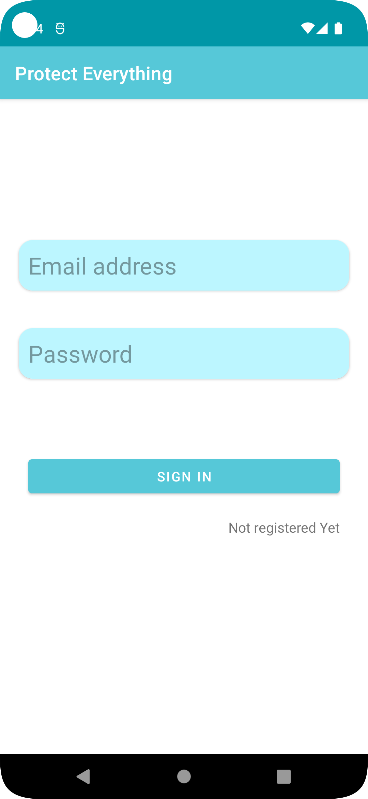
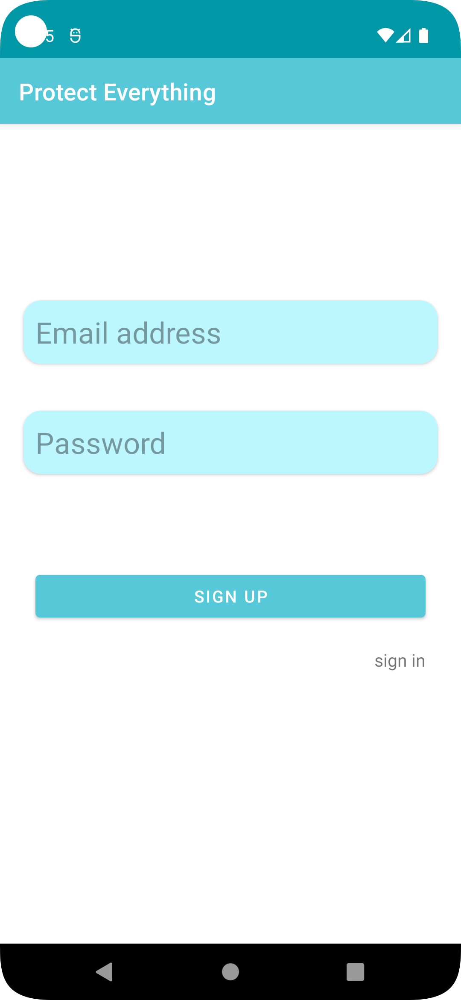
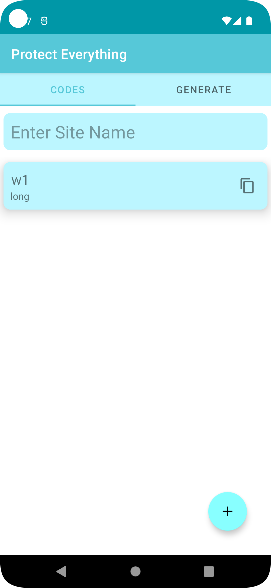
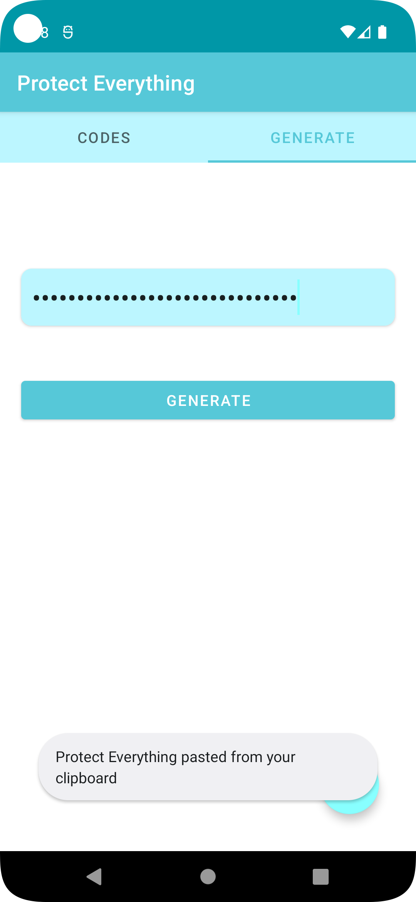
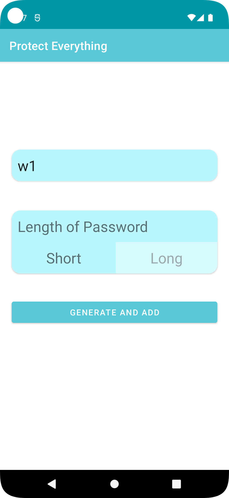

# About
This apps generate password which satisfy condition of the most of websites and application. Then the app stores the password in Firebase database. Users can retrieve the same password for future login.

### This app has 5 interface:
| S.N          |  Interface        |
| -------------|-------------------|
| 1 | Sign In                      |
| 2 | Sign Up                      |
| 3 | Main (List of passwords)     |
| 4 | Get Password from Code       |
| 5 | Generate password for Sign up|
||

## 1. Sign In

## 2. Sign Up

## 3. Main (List of passwords)

## 4. Get Password from Code

## 5. Generate New Password

